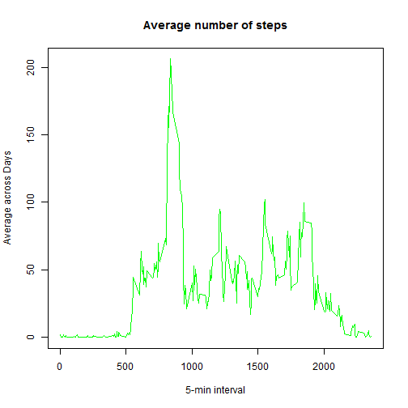
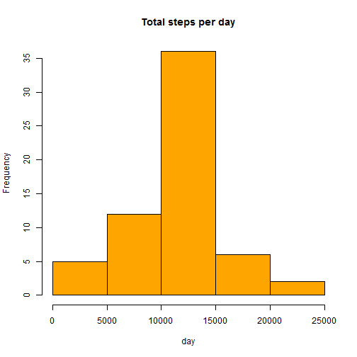

Loading and preprocessing the data

```r
activity <- read.csv(file="activity.csv",head=TRUE,sep=",")
activitynoNA <- na.omit(activity)
```

What is mean total number of steps taken per day?


```r
totalsteps <- aggregate(steps ~ date, data = activitynoNA, sum)
hist(totalsteps$steps, main = "Total Steps by day", xlab = "day", col = "blue")
```

 

```r
mean(totalsteps$steps)
```

```
## [1] 10766.19
```

```r
median(totalsteps$steps)
```

```
## [1] 10765
```

What is the average daily activity pattern?


```r
timeseries <- tapply(activitynoNA$steps, activitynoNA$interval, mean)
plot(row.names(timeseries), timeseries, type = "l", xlab = "5-min interval", 
    ylab = "Average across Days", main = "Average number of steps", 
    col = "green")
```

 

```r
names(which.max(timeseries))
```

```
## [1] "835"
```

Imputing Missing Values


```r
NAnumber <- sum(is.na(activity))
NAnumber
```

```
## [1] 2304
```

```r
averagesteps <- aggregate(steps ~ interval, data = activity, FUN = mean)
fillNA <- numeric()
for (i in 1:nrow(activity)) {
    x <- activity[i, ]
    if (is.na(x$steps)) {
        steps <- subset(averagesteps, interval == x$interval)$steps
    } else {
        steps <- x$steps
    }
    fillNA <- c(fillNA, steps)
}
newactivity <- activity
newactivity$steps <- fillNA
totalsteps2 <- aggregate(steps ~ date, data = newactivity, sum, na.rm = TRUE)
hist(totalsteps2$steps, main = "Total steps per day", xlab = "day", col = "orange")
```

 

```r
mean(totalsteps2$steps)
```

```
## [1] 10766.19
```

```r
median(totalsteps2$steps)
```

```
## [1] 10766.19
```

Are there differences in activity patterns between weekdays and weekends?


```r
library(lattice)
activity$date <- as.Date(activity$date, "%Y-%m-%d")
day <- weekdays(activity$date)
daylevel <- vector()
for (i in 1:nrow(activity)) {
    if (day[i] == "Saturday") {
        daylevel[i] <- "Weekend"
    } else if (day[i] == "Sunday") {
        daylevel[i] <- "Weekend"
    } else {
        daylevel[i] <- "Weekday"
    }
}
activity$daylevel <- daylevel
activity$daylevel <- factor(activity$daylevel)

stepsperday <- aggregate(steps ~ interval + daylevel, data = activity, mean)
names(stepsperday) <- c("interval", "daylevel", "steps")

xyplot(steps ~ interval | daylevel, stepsperday, type = "l", layout = c(1, 2), 
    xlab = "Interval", ylab = "Number of steps")
```

 
